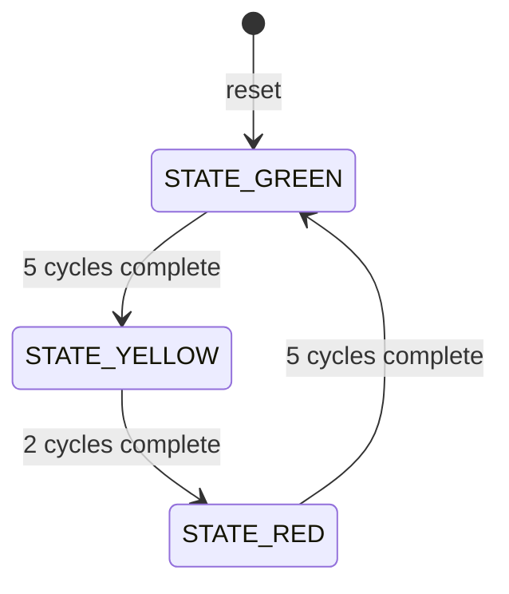

# Traffic Light Controller in Verilog

<p align="center">
	<strong>A compact, synthesizable RTL design for a timed traffic-light FSM</strong><br>
	<sub>Finite-state machine design • Sequential logic • Counter-based timing • Self-checking simulation</sub>
</p>

## At a Glance

This project models a single-road traffic light controller with a synchronous Moore finite-state machine. The controller cycles through green, yellow, and red, holding each state for a configurable number of clock cycles.

```text
				5 cycles       2 cycles       5 cycles
GREEN ------------> YELLOW -------> RED
	^                                  |
	|__________________________________|
```

The design is intentionally small enough to understand in one sitting, but complete enough to demonstrate a practical RTL workflow: specification, state encoding, timing logic, output decoding, testbench verification, and waveform inspection.

## Highlights

| Area | Implementation |
|---|---|
| Control model | Three-state Moore FSM |
| Timing | Parameterized cycle counter |
| Reset | Synchronous, active-high |
| Outputs | One-hot `red`, `yellow`, and `green` signals |
| Verification | Self-checking Verilog testbench with VCD dump |
| Tools | Icarus Verilog and GTKWave |

## FSM Design

The controller continuously follows this sequence:



An FSM is a natural fit because the controller has a small, finite set of operating modes and deterministic transitions. The state register stores the current mode, combinational logic selects the next state, and the output decoder activates only the light associated with the current state.

## State and Timing Table

| State | Red | Yellow | Green | Duration |
|---|---:|---:|---:|---:|
| `STATE_GREEN` | 0 | 0 | 1 | 5 clock cycles |
| `STATE_YELLOW` | 0 | 1 | 0 | 2 clock cycles |
| `STATE_RED` | 1 | 0 | 0 | 5 clock cycles |

The default timing values are deliberately short so that the behavior is easy to observe in simulation.

## How the RTL Works

At every rising edge of `clk`, the sequential block either applies reset or updates `current_state` and `cycle_count`. While a state is active, the counter increments. On the final cycle for that state, `next_state` changes and the counter resets to zero. Outputs are Moore-style combinational signals derived only from `current_state`, so exactly one light is asserted for every valid state.

1. On a rising edge of `clk`, `reset` initializes the FSM to `STATE_GREEN` and clears the counter.
2. While a state is active, `cycle_count` increments once per clock.
3. When the state duration is reached, the FSM advances to the next state and clears the counter.
4. The combinational output decoder drives exactly one light high.

The timing values can be changed at instantiation:

```verilog
traffic_light_controller #(
	.GREEN_CYCLES(10),
	.YELLOW_CYCLES(3),
	.RED_CYCLES(10)
) dut (...);
```

## Inputs and Outputs

| Signal | Direction | Description |
|---|---|---|
| `clk` | Input | System clock. State and counter update on its rising edge. |
| `reset` | Input | Synchronous active-high reset; starts in green. |
| `red` | Output | High only during `STATE_RED`. |
| `yellow` | Output | High only during `STATE_YELLOW`. |
| `green` | Output | High only during `STATE_GREEN`. |

## Design Files

## Repository Structure

```text
TRAFFIC-LIGHT-CONTROLLER-VERILOG/
├── rtl/
│   └── traffic_light_controller.v
├── tb/
│   └── traffic_light_controller_tb.v
├── waveform/
│   └── traffic_light_waveform.svg
├── docs/
│   └── block_diagram.svg
└── README.md
```

The block diagram represents the data flow `clock/reset -> FSM and counter -> traffic-light outputs`. The included SVG references are editable documentation assets. They can be exported to PNG for a portfolio using any SVG-capable editor.

## Run the Simulation

Install [Icarus Verilog](https://steveicarus.github.io/iverilog/) and [GTKWave](https://gtkwave.sourceforge.net/), then run these commands from the repository root:

```sh
iverilog -g2012 -o traffic_sim rtl/traffic_light_controller.v tb/traffic_light_controller_tb.v
vvp traffic_sim
```

The testbench writes `traffic_light_waveform.vcd` in the repository root. Open the waveform with:

```sh
gtkwave traffic_light_waveform.vcd
```

In GTKWave, add these signals:

- `clk` and `reset` for the control timing.
- `dut.current_state` to see the FSM sequence.
- `dut.cycle_count` to see each state duration.
- `red`, `yellow`, and `green` to verify one-hot outputs.

The testbench is expected to report:

```text
PASS: traffic light FSM timing, sequence, and one-hot outputs verified.
```

## Verification Scope

The testbench checks:

- Reset starts the controller in green.
- Green remains active for 5 clock cycles.
- Yellow remains active for 2 clock cycles.
- Red remains active for 5 clock cycles.
- The sequence returns to green and continues cycling.
- No more than one light is active at any time.

After reset, the expected output is `green=1`, `yellow=0`, and `red=0`.

## Technologies Used

- Verilog HDL
- RTL finite state machine design
- Icarus Verilog simulation
- GTKWave waveform inspection

## Possible Extensions

- Two-way intersection control
- Pedestrian crossing request
- Emergency vehicle priority
- Night mode
- Traffic density input and sensors
- Additional parameterized timing profiles
- FPGA implementation with board-level LEDs

## Portfolio Checklist

For a strong project presentation, include:

- A simulator-console screenshot showing the passing self-checking testbench.
- A GTKWave screenshot with the state, counter, and three light outputs visible.
- The FSM block diagram exported from `docs/block_diagram.svg`.

## License

This project is intended as an educational and portfolio reference for digital design and Verilog RTL development.